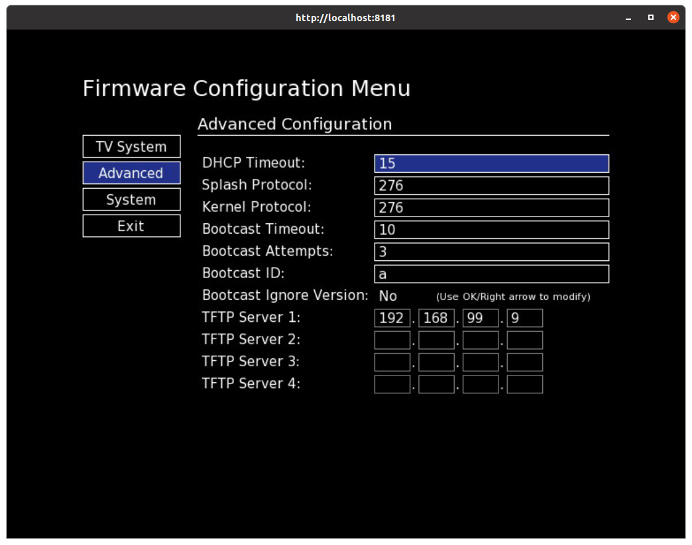
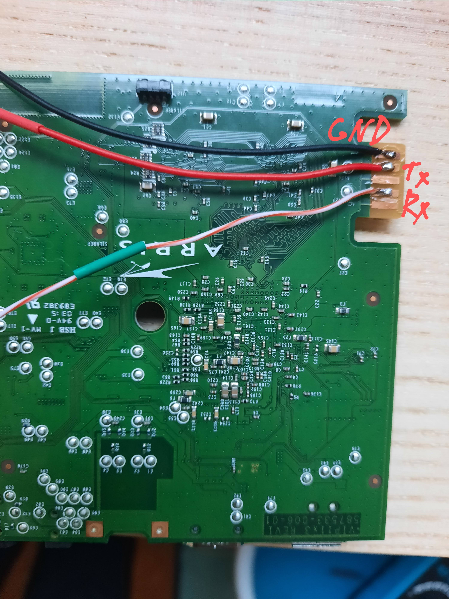
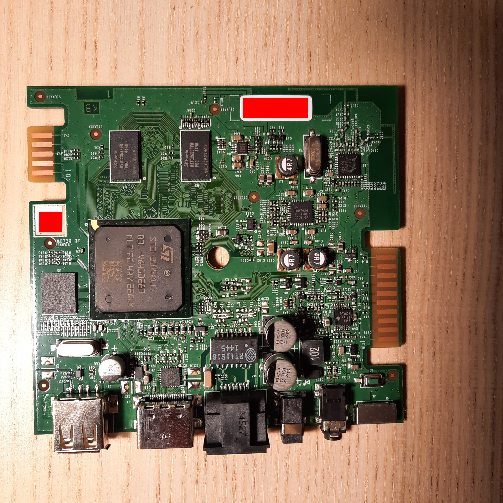
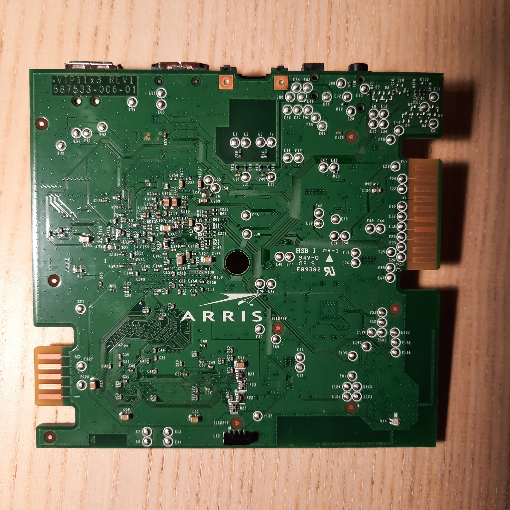

# arris-vip1113
Hacking Telia TV box Arris VIP1113

# Boot log (no firmware available in NAND)

```
System memory: 512 MB
Using Slot 1
Unpacking Image ...Done
Linux version 2.6.32.59_stm24_0211 (<build_user_removed>@<build_host_removed>) (gcc version 4.7.3 20130514 (GCC) ) #1 PREEMPT <timestamp_removed>
Boot params:
... MOUNT_ROOT_RDONLY - 00000001
... RAMDISK_FLAGS     - 00000000
... ORIG_ROOT_DEV     - 00000200
... LOADER_TYPE       - 00000001
... INITRD_START      - 04463000
... INITRD_SIZE       - 0039c200
extend_cmd_line =
Booting machvec: vip28x3
Reserve 10240 KiB for STAVMEM (0 KiB for graphics)
Node 0: start_pfn = 0x40000, low = 0x60000
Zone PFN ranges:
  Normal   0x00040000 -> 0x00060000
Movable zone start PFN for each node
early_node_map[1] active PFN ranges
    0: 0x00040000 -> 0x00060000
KreaTV VIP28x3/VIP11x3 board initialisation
bpa2: partition 'bigphysarea' created at 0x406d7000, size 4 kB (0x00001000 B)
STxH205/7 version 2.x
Built 1 zonelists in Zone order, mobility grouping on.  Total pages: 130048
Kernel command line: console=ttyAS0,115200 mtdparts=stm-nand-bch.0:0x00280000@0x00000000(rbl),0x00F00000@0x00280000(boot),0x06E80000@0x01180000(flash) hom=0x42090000 rblmem=0x00091000@0x42000000 bootdevice=nand bootfiles=fs systemmemsize=524288 rbl=2 rbl_mode=1 rbl_version=2.3.1 sw_version=5.4.3 dbl=1 bnb=1024 rootdisk=m:0x00000000@0x00000000 nwhwconf=device:eth0,hwaddr:xx:xx:xx:xx:xx:xx rbl_cap=1 bt=VIP1113-REV1
PID hash table entries: 2048 (order: 1, 8192 bytes)
Dentry cache hash table entries: 65536 (order: 6, 262144 bytes)
Inode-cache hash table entries: 32768 (order: 5, 131072 bytes)
PVR=04909420 CVR=60880000 PRR=0000aa00
I-cache : n_ways=2 n_sets=512 way_incr=16384
I-cache : entry_mask=0x00003fe0 alias_mask=0x00003000 n_aliases=4
D-cache : n_ways=2 n_sets=512 way_incr=16384
D-cache : entry_mask=0x00003fe0 alias_mask=0x00003000 n_aliases=4
Memory: 502144k/524288k available (2004k kernel code, 664k data, 128k init)
Hierarchical RCU implementation.
NR_IRQS:600
Console: colour dummy device 80x25
console [ttyAS0] enabled
sh_tmu: TMU0 used for clock events
sh_tmu: TMU0 used for periodic clock events
sh_tmu: TMU1 used as clock source
Calibrating delay loop (skipped)... 650.00 BogoMIPS PRESET (lpj=325000)
Mount-cache hash table entries: 512
CPU: STxH205
NET: Registered protocol family 16
bio: create slab <bio-0> at 0
SCSI subsystem initialized
usbcore: registered new interface driver usbfs
usbcore: registered new interface driver hub
usbcore: registered new device driver usb
Switching to clocksource TMU1
NET: Registered protocol family 2
IP route cache hash table entries: 4096 (order: 2, 16384 bytes)
TCP established hash table entries: 16384 (order: 5, 131072 bytes)
TCP bind hash table entries: 16384 (order: 4, 65536 bytes)
TCP: Hash tables configured (established 16384 bind 16384)
TCP reno registered
NET: Registered protocol family 1
Unpacking initramfs...
Overmounted tmpfs
Freeing initrd memory: 3696k freed
msgmni has been set to 988
alg: No test for stdrng (krng)
io scheduler noop registered
io scheduler anticipatory registered (default)
STMicroelectronics ASC driver initialized
stm-asc.0: ttyAS0 at MMIO 0xfd731000 (irq = 217) is a stm-asc
loop: module loaded
ONFI flash detected
ONFI param page 0 valid
NAND device: Manufacturer ID: 0x2c, Chip ID: 0xf1 (Micron MT29F1G08ABAEAH4)
stm-nand-bch stm-nand-bch.0: Using ONFI Timing Mode 3
stm-nand-bch stm-nand-bch.0: Failed to get BCH clock, assuming default 200MHz
stm-nand-bch stm-nand-bch.0: WARNING: bit-flips threshold not specified.  Defaulting to ECC strength [18]
stm-nand-bch stm-nand-bch.0: found BBT [primary:1] at block [1023] (STLinux 2.6.32.57_stm24_0210 (stm-nand-bch))
stm-nand-bch stm-nand-bch.0: block [1020] is bbt reserved
stm-nand-bch stm-nand-bch.0: block [1021] is bbt reserved
stm-nand-bch stm-nand-bch.0: block [1022] is bbt reserved
stm-nand-bch stm-nand-bch.0: found BBT [mirror:1] at 0x000007fc0000 [1022] (STLinux 2.6.32.57_stm24_0210 (stm-nand-bch))
stm-nand-bch stm-nand-bch.0: block [1023] is bbt reserved
stm-nand-bch stm-nand-bch.0: found BBT [primary:1] at 0x000007fe0000 [1023] (STLinux 2.6.32.57_stm24_0210 (stm-nand-bch))
stm-nand-bch stm-nand-bch.0: using BBT [primary:1] at 0x000007fe0000 [1023]
stm-nand-bch BBT:
                Block 0x07f80000 [01020] reserved for BBT
                Block 0x07fa0000 [01021] reserved for BBT
                Block 0x07fc0000 [01022] reserved for BBT
                Block 0x07fc0000 [01022] used by BBT1
                Block 0x07fe0000 [01023] reserved for BBT
                Block 0x07fe0000 [01023] used by BBT0
                No bad blocks listed in BBT
3 cmdlinepart partitions found on MTD device stm-nand-bch.0
Creating 3 MTD partitions on "stm-nand-bch.0":
0x000000000000-0x000000280000 : "rbl"
0x000000280000-0x000001180000 : "boot"
0x000001180000-0x000008000000 : "flash"
spi-stm spi-stm.0: registered SPI Bus 0
stmmac - user ID: 0x10, Synopsys ID: 0x36
 DMA HW capability register supported
 Enhanced/Alternate descriptors
 RX Checksum Offload Engine supported
 TX Checksum insertion supported
 Wake-Up On Lan supported
nwhw_config: (eth0) setting mac address: xx:xx:xx:xx:xx:xx
ehci_hcd: USB 2.0 'Enhanced' Host Controller (EHCI) Driver
ohci_hcd: USB 1.1 'Open' Host Controller (OHCI) Driver
stm_usb_probe: usb_phy_clk clock not found for stm-usb.0
stm-ehci stm-ehci.0: STMicroelectronics EHCI Host Controller
stm-ehci stm-ehci.0: new USB bus registered, assigned bus number 1
stm-ehci stm-ehci.0: irq 235, io mem 0xfe0ffe00
stm-ehci stm-ehci.0: USB 0.0 started, EHCI 1.00
usb usb1: configuration #1 chosen from 1 choice
hub 1-0:1.0: USB hub found
hub 1-0:1.0: 1 port detected
stm-ohci stm-ohci.0: STMicroelectronics OHCI Host Controller
stm-ohci stm-ohci.0: new USB bus registered, assigned bus number 2
stm-ohci stm-ohci.0: irq 238, io mem 0xfe0ffc00
usb usb2: configuration #1 chosen from 1 choice
hub 2-0:1.0: USB hub found
hub 2-0:1.0: 1 port detected
stm_usb_probe: usb_phy_clk clock not found for stm-usb.1
stm-ehci stm-ehci.1: STMicroelectronics EHCI Host Controller
stm-ehci stm-ehci.1: new USB bus registered, assigned bus number 3
stm-ehci stm-ehci.1: irq 236, io mem 0xfe1ffe00
stm-ehci stm-ehci.1: USB 0.0 started, EHCI 1.00
usb usb3: configuration #1 chosen from 1 choice
hub 3-0:1.0: USB hub found
hub 3-0:1.0: 1 port detected
stm-ohci stm-ohci.1: STMicroelectronics OHCI Host Controller
stm-ohci stm-ohci.1: new USB bus registered, assigned bus number 4
stm-ohci stm-ohci.1: irq 239, io mem 0xfe1ffc00
hub 1-0:1.0: over-current change on port 1
usb usb4: configuration #1 chosen from 1 choice
hub 4-0:1.0: USB hub found
hub 4-0:1.0: 1 port detected
Initializing USB Mass Storage driver...
usbcore: registered new interface driver usb-storage
USB Mass Storage support registered.
i2c /dev entries driver
Software Watchdog Timer: 0.07 initialized. soft_noboot=0 soft_margin=60 sec (nowayout= 1)
sh_tmu: TMU0 kept as earlytimer
sh_tmu: TMU1 kept as earlytimer
usbcore: registered new interface driver usbhid
usbhid: v2.6:USB HID core driver
stm-hwrandom stm-hwrandom: STM Random Number Generator ver. 0.1
stm-rng hardware driver 1.0 configured
TCP cubic registered
NET: Registered protocol family 17
Freeing unused kernel memory: 128k freed
DBL init started
DBL version STABLE_FIRMWARE_5.4.3@380102 (dailybuild@invergordon) (sh4-kreatv-linux-uclibc-gcc (GCC) 4.7.3 20130514)# Fri Apr 11 13:02:23 CEST 2014
Mounting tmpfs
Mounting procfs
Mounting sysfs
Mounting FFS
UBI: attached mtd2 to ubi0
UBI: background thread "ubi_bgt0d" started, PID 25
UBIFS: recovery needed
UBIFS: recovery completed
UBIFS: mounted UBI device 0, volume 0, name "flash"
Initializing HAL
stsys_core: module license 'ST Microelectronics' taints kernel.
Disabling lock debugging due to kernel taint
Load module stos_core [?]               by insmod (pid 29)
Load module stcommon_core [?]           by insmod (pid 30)
Module stapler_core (rev: STAPLER-REL_1.10.2) loaded by insmod (pid 31)
Load module sttkd_core (revision: STTKD_REL_1.8.2 NOT_BOOTED-) by insmod (pid 32)
Load module sttkd_ioctl by insmod (pid 33)
Verifying system integrity...
Unable to open file '/flash/.userparam': No such file or directory
System integrity is intact
hub 3-0:1.0: over-current change on port 1
Running on ARRIS VIP1113 with KreaTV Firmware version 5.4.3
Using Vendor Class Id ARRIS_VIP1113
Using Bootcast Id arris-vip1113
Using SAP Id arris.vip1113
frontpanel: Normal probing is used
frontpanel: vip11x3 without optional leds
front_panel driver loaded
input: KreaTV input as /devices/virtual/input/input0
Input driver loaded
IR driver loaded
GP510 driver loaded
Initializing video
<N>irdecoder: Read 1121 mappings in 20 protocols from /etc/irmap.conf
<N>irdecoder: Read 54 mappings in 1 protocols from /etc/rf4cemap.conf
<N>irdecoder: Initialized ST software decoder with nec timeout value 600
Entering video active mode
No valid splash image in local storage
DVB is NOT available
RLE-8 compressed image
vp: 17ffc
ProgDescr: magic 79ac ver 0
 vp: 8500
 pShmem: 8750 pTestCtrlInfo 0
ShMemInfo: ver 5
 LogBuf: 4e70, len 254
 ReqBuf: 4f70, len 138
 ```

# Hidden menu

Source: "kreatv-kit-sdk_4.3.IAP30.3_st40/doc/booting/firmware/ip.html"

```
2. Enter code [2 3 5 7] by using the number buttons on the remote control.
This will show the hidden IP option.

Note! This code should be kept secret, and never disclosed to any end customers. 
```
LOL

1. boot
2. press menu
3. enter 2357 - hidden IP config appears
4. enter 7532 - hidden boot config appears

Default boot order: 313

# Hidden settings to enable TFTP



# Defaut boot order

Source: "kreatv-kit-sdk_4.3.IAP30.3_st40/doc/booting/dhcp/dhcp_options_kreatv_firmware.html"

Kernel protocol 313 means kernel image will be downloaded using method "3", if failed try method "1", if failed again method "3".
Every digit means some method:

* 1 = BootCast
* 2 = TFTP
* 3 = Local Storage (if available)
* 4 = SAP (Session Announcement Protocol)
* 5 = DVD/CD (if available)
* 6 = HTTP (available from version 3.03)
* 7 = USB
* 8,9 = not used

By entering "12345" or "34567" you can check which code does what. You should see on the serial console kernel image download process.

# Boot log of Telia firmware

```
Using TFTP
TFTP: Server pool attempt 1 of 8
TFTP: Server node attempt 1 of 2
Connecting to 192.168.99.9
Sending read request for B
Negotiation block size = 512
Negotiation transfer size = 33471921
Download completed
Verifying image...
Using classical image.
Uncompressing image...
Loading new kernel...
Initrd at 0x84ffa000, length 23034 bytes
Command line (487 bytes):  console=ttyAS0,115200 mtdparts=stm-nand-bch.0:0x00280000@0x00000000(rbl),0x00F00000@0x00280000(boot),0x06E80000@0x01180000(flash) ip=192.168.99.156::192.168.99.1:255.255.255.0 nwhwconf=device:eth0,hwaddr:xx:xx:xx:xx:xx:xx bnb=1024 rbl=2 rbl_mode=1 rbl_version=2.3.1 dbl=2 bt=VIP1113-REV1 hom=0x42090000 rblmem=0x00091000@0x42000000 bootdevice=nand bootfiles=fs bch=224.2.2.2:22222 systemmemsize=524288 netconsole=@192.168.99.156/eth0,11112@192.168.99.9/ rootdisk=m:0x01e38000@0x831c2000
Kernel loaded successfully
Disabling IR...
Terminating irdecoder process
<N>irdecoder: received SIGTERM (exiting)
Unloading GP510 module...
Unmounting FFS2...
UBIFS: un-mount UBI device 0, volume 0
UBI: mtd2 is detached from ubi0
Starting new kernel...
Bringing down interface eth0
Sending failed for [[4]Bringing down interface eth0]: Network is unreachable
Starting new kernel
kexec information
  segment[0]: 0x80800000 - 0x80b02000 (0x00302000)
  segment[1]: 0x84ffa000 - 0x85000000 (0x00006000)
  segment[2]: 0x831c2000 - 0x84ffa000 (0x01e38000)
  start     : 0x80801000

Linux version 2.6.32.59_stm24_0211 (autobuilder@basic-centos7--1-1) (gcc version 4.7.3 20130514 (GCC) ) #1 PREEMPT Wed Jul 31 09:00:22 UTC 2019
Boot params:
... MOUNT_ROOT_RDONLY - 00000001
... RAMDISK_FLAGS     - 00000000
... ORIG_ROOT_DEV     - 00000200
... LOADER_TYPE       - 00000001
... INITRD_START      - 04ffa000
... INITRD_SIZE       - 000059fa
extend_cmd_line =  companions_mem_size=6291456 gfx_mem_size=0x397D000
Booting machvec: vip28x3
Reserve 120308 KiB for STAVMEM (58868 KiB for graphics)
Node 0: start_pfn = 0x40000, low = 0x60000
Zone PFN ranges:
  Normal   0x00040000 -> 0x00060000
Movable zone start PFN for each node
early_node_map[1] active PFN ranges
    0: 0x00040000 -> 0x00060000
KreaTV VIP28x3/VIP11x3 board initialisation
bpa2: partition 'bigphysarea' created at 0x40f19000, size 1600 kB (0x00190000 B)
STxH205/7 version 2.x
Built 1 zonelists in Zone order, mobility grouping on.  Total pages: 130048
Kernel command line:  console=ttyAS0,115200 mtdparts=stm-nand-bch.0:0x00280000@0x00000000(rbl),0x00F00000@0x00280000(boot),0x06E80000@0x01180000(flash) ip=192.168.99.156::192.168.99.1:255.255.255.0 nwhwconf=device:eth0,hwaddr:xx:xx:xx:xx:xx:xx bnb=1024 rbl=2 rbl_mode=1 rbl_version=2.3.1 dbl=2 bt=VIP1113-REV1 hom=0x42090000 rblmem=0x00091000@0x42000000 bootdevice=nand bootfiles=fs bch=224.2.2.2:22222 systemmemsize=524288 netconsole=@192.168.99.156/eth0,11112@192.168.99.9/ rootdisk=m:0x01e38000@0x831c2000 companions_mem_size=6291456 gfx_mem_size=0x397D000
PID hash table entries: 2048 (order: 1, 8192 bytes)
Dentry cache hash table entries: 65536 (order: 6, 262144 bytes)
Inode-cache hash table entries: 32768 (order: 5, 131072 bytes)
PVR=04909420 CVR=60880000 PRR=0000aa00
I-cache : n_ways=2 n_sets=512 way_incr=16384
I-cache : entry_mask=0x00003fe0 alias_mask=0x00003000 n_aliases=4
D-cache : n_ways=2 n_sets=512 way_incr=16384
D-cache : entry_mask=0x00003fe0 alias_mask=0x00003000 n_aliases=4
Memory: 356608k/524288k available (2303k kernel code, 647k data, 124k init)
Hierarchical RCU implementation.
NR_IRQS:600
Console: colour dummy device 80x25
console [ttyAS0] enabled
sh_tmu: TMU0 used for clock events
sh_tmu: TMU0 used for periodic clock events
sh_tmu: TMU1 used as clock source
Calibrating delay loop (skipped)... 650.00 BogoMIPS PRESET (lpj=325000)
Mount-cache hash table entries: 512
CPU: STxH205
[STM][PM-Sys]: ilc3 @ 4096
NET: Registered protocol family 16
bio: create slab <bio-0> at 0
SCSI subsystem initialized
Switching to clocksource TMU1
NET: Registered protocol family 2
IP route cache hash table entries: 4096 (order: 2, 16384 bytes)
TCP established hash table entries: 16384 (order: 5, 131072 bytes)
TCP bind hash table entries: 16384 (order: 4, 65536 bytes)
TCP: Hash tables configured (established 16384 bind 16384)
TCP reno registered
NET: Registered protocol family 1
Unpacking initramfs...
Freeing initrd memory: 22k freed
[STM]: [PM]: Suspend support registered
[STM]: [PM]: HoM support registered
[STM]: [PM]: [HoM]: Early console @ fd731000
squashfs: version 4.0 (2009/01/31) Phillip Lougher
Registering unionfs 2.5.5 (for 2.6.32.18)
msgmni has been set to 697
alg: No test for stdrng (krng)
io scheduler noop registered
io scheduler cfq registered (default)
STMicroelectronics ASC driver initialized
stm-asc.0: ttyAS0 at MMIO 0xfd731000 (irq = 217) is a stm-asc
loop: module loaded
ONFI flash detected
ONFI param page 0 valid
NAND device: Manufacturer ID: 0x2c, Chip ID: 0xf1 (Micron MT29F1G08ABAEAH4)
stm-nand-bch stm-nand-bch.0: Using ONFI Timing Mode 3
stm-nand-bch stm-nand-bch.0: Failed to get BCH clock, assuming default 200MHz
stm-nand-bch stm-nand-bch.0: WARNING: bit-flips threshold not specified.  Defaulting to ECC strength [18]
stm-nand-bch stm-nand-bch.0: found BBT [primary:1] at block [1023] (STLinux 2.6.32.57_stm24_0210 (stm-nand-bch))
stm-nand-bch stm-nand-bch.0: block [1020] is bbt reserved
stm-nand-bch stm-nand-bch.0: block [1021] is bbt reserved
stm-nand-bch stm-nand-bch.0: block [1022] is bbt reserved
stm-nand-bch stm-nand-bch.0: found BBT [mirror:1] at 0x000007fc0000 [1022] (STLinux 2.6.32.57_stm24_0210 (stm-nand-bch))
stm-nand-bch stm-nand-bch.0: block [1023] is bbt reserved
stm-nand-bch stm-nand-bch.0: found BBT [primary:1] at 0x000007fe0000 [1023] (STLinux 2.6.32.57_stm24_0210 (stm-nand-bch))
stm-nand-bch stm-nand-bch.0: using BBT [primary:1] at 0x000007fe0000 [1023]
stm-nand-bch BBT:
		Block 0x07f80000 [01020] reserved for BBT
		Block 0x07fa0000 [01021] reserved for BBT
		Block 0x07fc0000 [01022] reserved for BBT
		Block 0x07fc0000 [01022] used by BBT1
		Block 0x07fe0000 [01023] reserved for BBT
		Block 0x07fe0000 [01023] used by BBT0
		No bad blocks listed in BBT
3 cmdlinepart partitions found on MTD device stm-nand-bch.0
Creating 3 MTD partitions on "stm-nand-bch.0":
0x000000000000-0x000000280000 : "rbl"
0x000000280000-0x000001180000 : "boot"
0x000001180000-0x000008000000 : "flash"
spi-stm spi-stm.0: registered SPI Bus 0
stmmac - user ID: 0x10, Synopsys ID: 0x36
 DMA HW capability register supported
 Enhanced/Alternate descriptors
 RX Checksum Offload Engine supported
 TX Checksum insertion supported
 Wake-Up On Lan supported
nwhw_config: (eth0) setting mac address: xx:xx:xx:xx:xx:xx
mice: PS/2 mouse device common for all mice
i2c /dev entries driver
Software Watchdog Timer: 0.07 initialized. soft_noboot=0 soft_margin=60 sec (nowayout= 1)
sh_tmu: TMU0 kept as earlytimer
sh_tmu: TMU1 kept as earlytimer
[STM][PM-Sys]: emi @ 40
[STM][PM-Sys]: gpio @ 20
[STM][PM-Sys]: sysconf @ 10
[STM][PM-Sys]: clk @ 30
STM_LPM driver registered
STM_WAKEUP_DEVICE registered err 0
stm-hwrandom stm-hwrandom: STM Random Number Generator ver. 0.1
stm-rng hardware driver 1.0 configured
TCP cubic registered
NET: Registered protocol family 17
stm-lpm stm-lpm.0: firmware: requesting lpm_fwSTxH205.elf
eth0: device MAC address xx:xx:xx:xx:xx:xx
STMMAC MII Bus: probed
eth0: PHY ID 02430c54 at 1 IRQ 201 (0:01) active
stmmac_timer: (eth0) sh_tmu Timer (freq 256Hz)
IP-Config: Complete:
     device=eth0, addr=192.168.99.156, mask=255.255.255.0, gw=192.168.99.1,
     host=192.168.99.156, domain=, nis-domain=(none),
     bootserver=255.255.255.255, rootserver=255.255.255.255, rootpath=
Freeing unused kernel memory: 124k freed

starting pid 21, tty '/dev/console': '/etc/rc.sysinit'
mount: mounting none on /sys/kernel/debug failed: No such file or directory
frontpanel: Normal probing is used
frontpanel: vip11x3 without optional leds
stos_core: module license 'ST Microelectronics' taints kernel.
Disabling lock debugging due to kernel taint
Load module stos_core [?]		by insmod (pid 37)
input: KreaTV input as /devices/virtual/input/input0
ir_dev: LPM firmware 1.1.1 loaded
ICS init 1 debug_flags 0x40 debug_chan 0x5 connect 0 watchdog 0 bpa2_part 'bigphysarea'
ICS: Using BPA2 partition 'bigphysarea'
Calling ICS_cpu_init(0, 0x7, 0x0)
MME module init=1 debug_flags=0x0 pool_size=524288
usbcore: registered new interface driver usbfs
usbcore: registered new interface driver hub
usbcore: registered new device driver usb
ehci_hcd: USB 2.0 'Enhanced' Host Controller (EHCI) Driver
ohci_hcd: USB 1.1 'Open' Host Controller (OHCI) Driver
stm_usb_probe: usb_phy_clk clock not found for stm-usb.0
stm-ehci stm-ehci.0: STMicroelectronics EHCI Host Controller
stm-ehci stm-ehci.0: new USB bus registered, assigned bus number 1
stm-ehci stm-ehci.0: irq 235, io mem 0xfe0ffe00
stm-ehci stm-ehci.0: USB 0.0 started, EHCI 1.00
usb usb1: configuration #1 chosen from 1 choice
hub 1-0:1.0: USB hub found
hub 1-0:1.0: 1 port detected
stm-ohci stm-ohci.0: STMicroelectronics OHCI Host Controller
stm-ohci stm-ohci.0: new USB bus registered, assigned bus number 2
stm-ohci stm-ohci.0: irq 238, io mem 0xfe0ffc00
usb usb2: configuration #1 chosen from 1 choice
hub 2-0:1.0: USB hub found
hub 2-0:1.0: 1 port detected
stm_usb_probe: usb_phy_clk clock not found for stm-usb.1
stm-ehci stm-ehci.1: STMicroelectronics EHCI Host Controller
stm-ehci stm-ehci.1: new USB bus registered, assigned bus number 3
stm-ehci stm-ehci.1: irq 236, io mem 0xfe1ffe00
stm-ehci stm-ehci.1: USB 0.0 started, EHCI 1.00
usb usb3: configuration #1 chosen from 1 choice
hub 3-0:1.0: USB hub found
hub 3-0:1.0: 1 port detected
stm-ohci stm-ohci.1: STMicroelectronics OHCI Host Controller
stm-ohci stm-ohci.1: new USB bus registered, assigned bus number 4
stm-ohci stm-ohci.1: irq 239, io mem 0xfe1ffc00
usb usb4: configuration #1 chosen from 1 choice
hub 4-0:1.0: USB hub found
hub 4-0:1.0: 1 port detected
usbcore: registered new interface driver usbhid
usbhid: v2.6:USB HID core driver
Initializing USB Mass Storage driver...
usbcore: registered new interface driver usb-storage
USB Mass Storage support registered.
LXLOAD(video1)	: LX loaded => Base=0x40000000 - Last=0x40113824 - Size=1128484
Uniform Multi-Platform E-IDE driver
JFS: nTxBlock = 2790, nTxLock = 22322
usb 2-1: new low speed USB device using stm-ohci and address 2
PHY: 0:01 - Link is Up - 100/Full
MiPHY driver style MiPHYA40X probed successfully
MiPHYA40X, c2.1 Claimed by ahci.0 
usb 2-1: configuration #1 chosen from 1 choice
input: CHICONY HP Basic USB Keyboard as /devices/platform/stm-usb.0/stm-ohci.0/usb2/2-1/2-1:1.0/input/input1
generic-usb 0003:03F0:0024.0001: input: USB HID v1.11 Keyboard [CHICONY HP Basic USB Keyboard] on usb-stm-ohci.0-1/input0
LXLOAD(audio1)	: LX loaded => Base=0x40300000 - Last=0x4048bc34 - Size=1621044
ahci ahci.0: forcing PORTS_IMPL to 0x1
ahci ahci.0: AHCI 0001.0300 32 slots 1 ports 3 Gbps 0x1 impl platform mode
ahci ahci.0: flags: ncq sntf pm led clo only pmp pio slum part ccc apst 
scsi0 : ahci
ata1: SATA max UDMA/133 mmio [0xfd548000-0xfd548fff] port 0x100 irq 234
Load module sttbx_core [?]		by insmod (pid 170)
Load module stavmem_core [?]		by insmod (pid 170)
AVMEM partition 0: start 48400000 size 3c00000
AVMEM partition 1: start 4c683000 size 397d000
Load module stclock_core [250]		by insmod (pid 170)
Load module stevt_core [?]		by insmod (pid 170)
Load module stcommon_core [?]		by insmod (pid 170)
Load module stpti5_core [?]		by insmod (pid 170)
Load module stclkrv_core [?]		by insmod (pid 170)
Load module stfdma_core [249]		by insmod (pid 170)
ata1: SATA link down (SStatus 0 SControl 300)
Load module stbuffer_core [?]		by insmod (pid 170)
Load module stinject_core [?]		by insmod (pid 170)
Load module stsmart_core [248]		by insmod (pid 170)
Load module stpio_core [?]		by insmod (pid 170)
Load module stdenc_core [?]		by insmod (pid 170)
Load module stlayer_core [?]		by insmod (pid 170)
Load module stvout_core [?]		by insmod (pid 170)
Load module stvtg_core [?]		by insmod (pid 170)
Load module stvid_core [?]		by insmod (pid 170)
Load module stvmix_core [?]		by insmod (pid 170)
Load module staudlx_core [247]		by insmod (pid 170)
Load module stvbi_core [?]		by insmod (pid 170)
Load module stblit_core [?]		by insmod (pid 170)
Module stapler_core (rev: STAPLER-REL_1.10.2) loaded by insmod (pid 170)
Load module stttx_core [?]		by insmod (pid 170)
Load module sttkd_core (revision: STTKD_REL_1.8.2 NOT_BOOTED-) by insmod (pid 170)
Load module stevt_ioctl [162]		by insmod (pid 170)
Load module stcommon_ioctl [160]	by insmod (pid 170)
Load module stpti5_ioctl [170]		by insmod (pid 170)
Load module stclkrv_ioctl [159]		by insmod (pid 170)
Load module stfdma_ioctl [163]		by insmod (pid 170)
Load module stbuffer_ioctl [182]	by insmod (pid 170)
udpfilter_kreatel initializing
Load module stinject_ioctl [183]	by insmod (pid 170)
Load module stpio_ioctl [168]		by insmod (pid 170)
Load module stdenc_ioctl [161]		by insmod (pid 170)
Load module stlayer_ioctl [166]		by insmod (pid 170)
Load module stvout_ioctl [177]		by insmod (pid 170)
Load module stvtg_ioctl [178]		by insmod (pid 170)
Load module stvid_ioctl [175]		by insmod (pid 170)
Load module stvmix_ioctl [176]		by insmod (pid 170)
Load module stvbi_ioctl [174]		by insmod (pid 170)
Load module stblit_ioctl [158]		by insmod (pid 170)
Load module stttx_ioctl [181]		by insmod (pid 170)
Load module stsys_ioctl [172]		by insmod (pid 170)
Load module sttkd_ioctl by insmod (pid 170)
mount: mounting none on /tmp/cgroup failed: No such device
UBI: attached mtd2 to ubi0
UBI: background thread "ubi_bgt0d" started, PID 228
UBIFS: mounted UBI device 0, volume 0, name "flash"
chmod: 777: No such file or directory
chmod: /usr/bin/curl: Read-only file system
stevt: Setting New buffer Size 32768
ir_dev: GP510 interrupt enabled
SoftDog: Unexpected close, not stopping watchdog!
Restarting system.
Manual soft reset!
```

# JTAG pinout


# UART



# PCB photos






